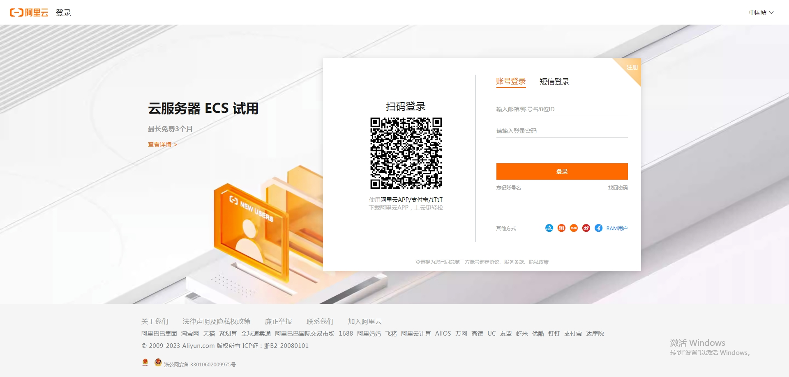

### 1.注册/登录阿里云账号

- [官网链接](https://account.aliyun.com/login/login.htm?oauth_callback=https%3A%2F%2Fwww.aliyun.com%2F%3Futm_content%3Dse_1015257992)
- 注册登录
  - 

### 2.选择阿里云OCR产品

- 选择产品
  - 

### 3.开通阿里云OCR产品

- 开通服务（每个月赠送200次，不用超就不额外收费）
  - 
  - 

### 4.进入调试页面，下载SDK示例

- 下载SDK模板
  - 

### 5.创建 AccessKey密钥

- [RAM传送门](https://ram.console.aliyun.com/users)
- 创建用户
  - 
  - 
  - 
- 复制AccessKey
  - 
  - 

### 6.下载源码并替换AccessKey

- 解压并打开刚下载的源码
  - 

- 选择开发环境
  - 

- 替换AccessKey
  - 

### 7.OCR识别测试

- 识别印刷体
  - 
- 识别手写体
  - 
- 识别增值税发票
  - 
- 识别出租车发票
  - 

