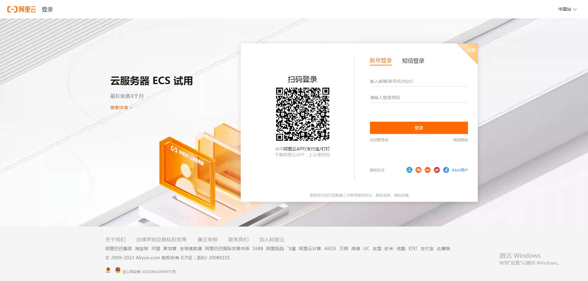

### 1.注册/登录阿里云账号

- [官网链接](https://account.aliyun.com/login/login.htm?oauth_callback=https%3A%2F%2Fwww.aliyun.com%2F%3Futm_content%3Dse_1015257992)
- 注册登录
  - 

### 2.在首页搜所通义千问

- [官网链接](https://www.aliyun.com/search?k=%E9%80%9A%E4%B9%89%E5%8D%83%E9%97%AE&scene=all)
- 

- 

#### 1.[安装DashScope SDK](https://help.aliyun.com/zh/dashscope/developer-reference/install-dashscope-sdk)

- 

- 

- 

#### 2.[开通DashScope并创建API-KEY](https://help.aliyun.com/zh/dashscope/developer-reference/activate-dashscope-and-create-an-api-key)

- 

- 这个过程官网描述的很详细，我这里就省略了>>>

- 保存好API-KEY

#### 3.创建一个示例进行测试

- 单轮对话
- 

- 

- 多轮对话
- 
- 流式输出
- 

- 流式输出API接口
- 